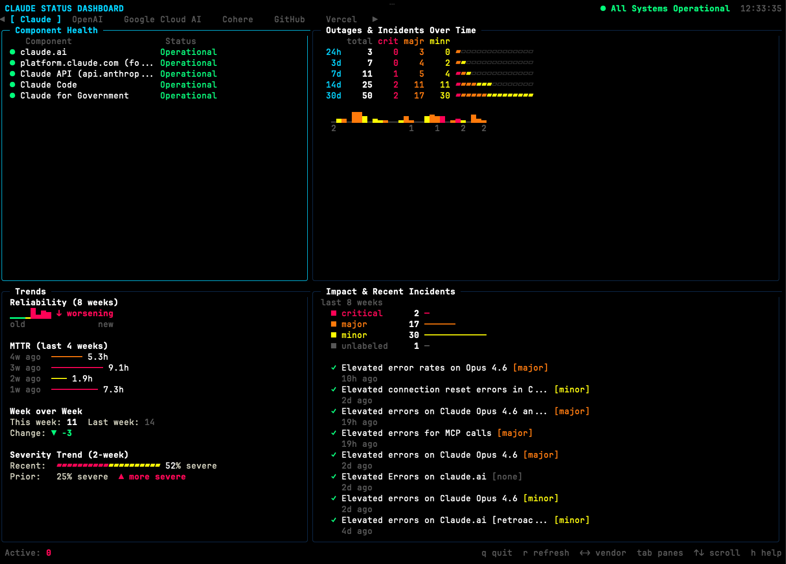
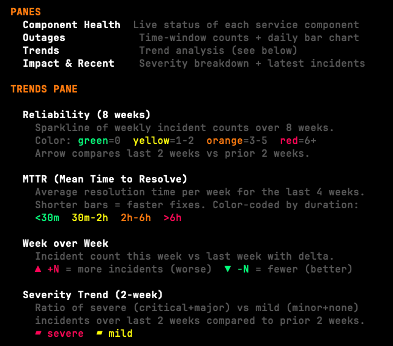
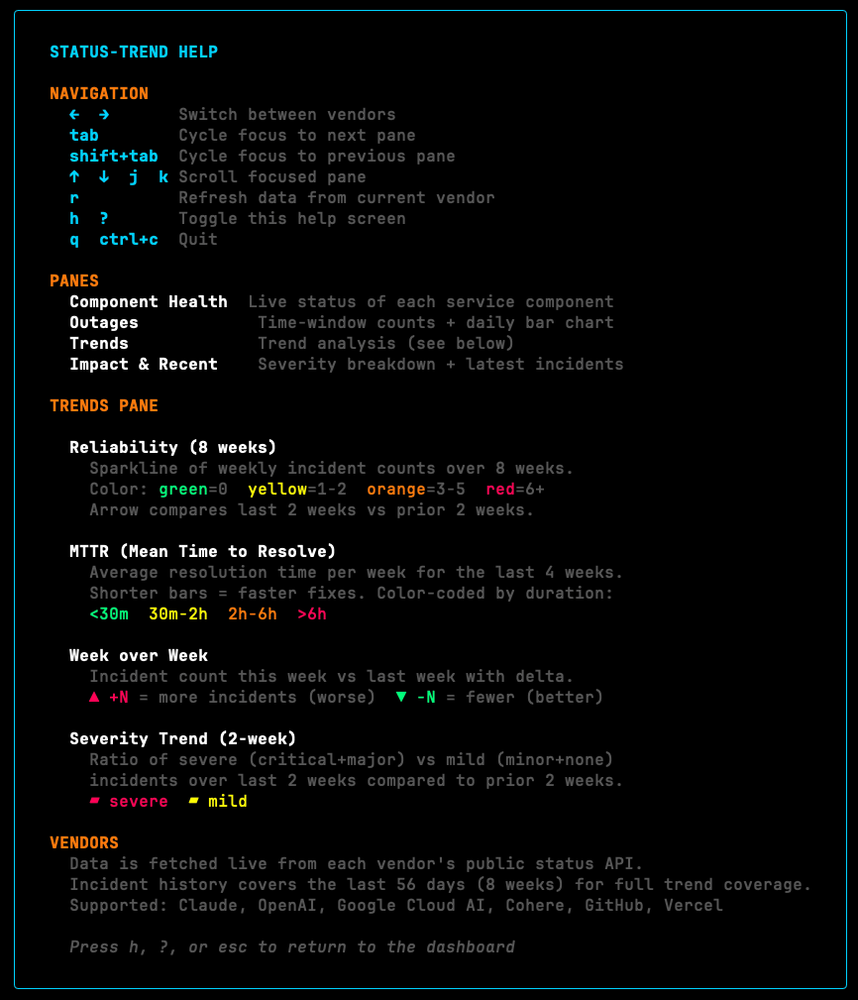
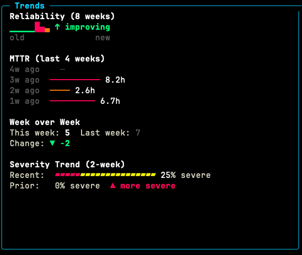

# status-trend

A terminal dashboard that visualizes outage and incident data from multiple vendor status pages. Built with [Bubble Tea](https://github.com/charmbracelet/bubbletea) and [Lip Gloss](https://github.com/charmbracelet/lipgloss).



## Supported Vendors

- Claude
- OpenAI
- Google Cloud AI
- Cohere
- GitHub
- Vercel

## Installation

### Prerequisites (macOS)

If you don't have Homebrew installed, install it first:

```bash
/bin/bash -c "$(curl -fsSL https://raw.githubusercontent.com/Homebrew/install/HEAD/install.sh)"
```

### Install via Homebrew

```bash
brew install aflansburg/tap/status-trend
```

### Install from Source

Requires Go 1.26+:

```bash
git clone https://github.com/aflansburg/status-trend.git
cd status-trend
go build -o status-trend .
```

## Usage

```bash
status-trend
```


### Dashboard Panes

The dashboard is organized into four panes:

| Pane | Description |
|------|-------------|
| **Component Health** | Live status of each service component |
| **Outages & Incidents** | Time-window counts + daily incident bar chart |
| **Trends** | Reliability sparklines, MTTR, week-over-week, severity trends |
| **Impact & Recent** | Severity breakdown + latest incidents |



### Keyboard Shortcuts

| Key | Action |
|-----|--------|
| `Left` / `Right` | Switch between vendors |
| `Tab` / `Shift+Tab` | Cycle focus between panes |
| `Up` / `Down` / `j` / `k` | Scroll focused pane |
| `r` | Refresh data |
| `h` / `?` | Toggle help screen |
| `q` / `Ctrl+C` | Quit |

Mouse support is also available: click to focus panes, click vendor names to switch, and scroll within panes.



### Trends Pane

The Trends pane provides deeper analysis over the last 8 weeks of incident data:

- **Reliability**: Weekly incident count sparkline, color-coded by severity (green = 0, yellow = 1-2, orange = 3-5, red = 6+)
- **MTTR**: Mean Time to Resolve per week, color-coded by duration
- **Week over Week**: Incident count delta between current and previous week
- **Severity Trend**: Ratio of severe vs mild incidents over a 2-week rolling window



## How It Works

Data is fetched live from each vendor's public status API. Most vendors use the [Atlassian Statuspage](https://www.atlassianstatuspage.com/) format. Google Cloud AI uses a dedicated implementation due to its different API structure. Incident history covers the last 56 days (8 weeks) for full trend coverage.

## License

MIT
